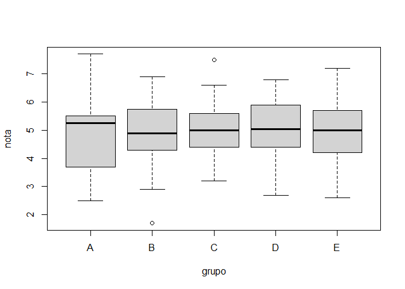
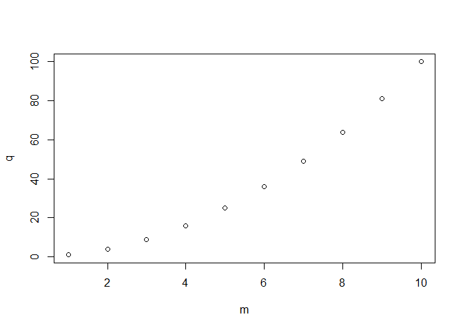
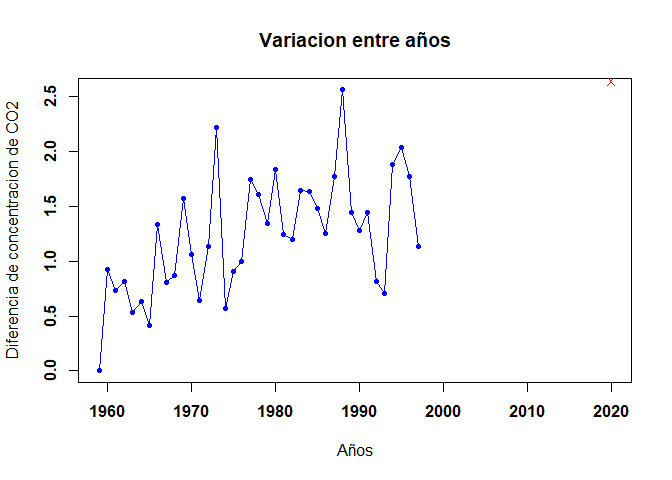

PROGRAMACION
================
GRUPO 10 \|
Fecha :18/11/21

**Integrantes:** *ALARCON CANDIOTTE*, Arthur \| *CALDAS MORALES*,
Fernando \| *VARGAS CAMPOS*, Valia

### PARTE 01

**1. Calcula los valores numéricos aproximados de**

**1.a**

``` r
      (0.3 * 0.15)/(0.3 * 0.15 + 0.2 * 0.8 + 0.5 * 0.12)
```

    ## [1] 0.1698113

``` r
      round((0.3 * 0.15)/(0.3 * 0.15 + 0.2 * 0.8 + 0.5 * 0.12),2) # Redondeando
```

    ## [1] 0.17

**1.b.**

``` r
      (5^6) * (exp(-5))/factorial(6)
```

    ## [1] 0.1462228

``` r
      round((5^6) * (exp(-5))/factorial(6),2) # Redondeando
```

    ## [1] 0.15

**1.c.**

``` r
      (factorial(20)/(factorial(13)*factorial(7)))*(0.4^7)*(0.6^13)
```

    ## [1] 0.1658823

``` r
      round((factorial(20)/(factorial(13)*factorial(7)))*(0.4^7)*(0.6^13),2) # Redondeando
```

    ## [1] 0.17

``` r
      #### Tambien podria hacerse creando una funcion 
        
      permutar = function(n,r){factorial(n)/(factorial(n-r)*factorial(r))}
      permutar(20,7)*(0.4^7)*(0.6^13)
```

    ## [1] 0.1658823

``` r
      round(permutar(20,7)*(0.4^7)*(0.6^13),2) # Redondenado 
```

    ## [1] 0.17

**2. Realizar la siguiente suma**

**2.a.**

``` r
      sum(1:1000)
```

    ## [1] 500500

**2.b.**

``` r
      n = (0:10)
      sum(2^n)
```

    ## [1] 2047

**3. El vector grupo representa el grupo al que pertenece una serie de
alumnos**

``` r
load(url("https://goo.gl/uDzU8v")) # Cargamos las variables almacenadas en el archivo     
```

**3.a.** *¿Cuántos elementos tiene?*

``` r
length(grupo)
```

    ## [1] 192

**3.b.** *¿En qué posiciones del vector está la letra “A?*

``` r
      which(grupo == "A")  
```

    ##  [1]   2   8  17  21  28  84 101 108 111 115 123 136 190 192

**4. El vector nota representa la nota de un examen de los alumnos que
están en los grupos del vector grupo.**

**4.a.** *¿Cuanto suman todas las notas?*

``` r
      sum(nota)
```

    ## [1] 962

**4.b.** *¿Cual es la media aritmética de todas las notas?*

``` r
      mean(nota)
```

    ## [1] 5.010417

**4.c.** *¿En qué posiciones están las notas mayores de 7.0?*

``` r
      which(nota > 7.0)
```

    ## [1]  81 103 120 151

**4.d.** *Visualiza las notas ordenadas de mayor a menor*

``` r
      sort(nota,decreasing = TRUE)
```

    ##   [1] 7.7 7.5 7.4 7.2 7.0 6.9 6.9 6.8 6.8 6.8 6.8 6.8 6.6 6.5 6.4 6.4 6.4 6.4
    ##  [19] 6.3 6.2 6.2 6.2 6.2 6.2 6.2 6.1 6.1 6.1 6.1 6.0 6.0 6.0 6.0 6.0 6.0 5.9
    ##  [37] 5.9 5.9 5.9 5.9 5.9 5.9 5.9 5.9 5.8 5.8 5.8 5.8 5.8 5.7 5.7 5.7 5.7 5.7
    ##  [55] 5.6 5.6 5.6 5.6 5.6 5.6 5.5 5.5 5.5 5.5 5.5 5.5 5.5 5.5 5.5 5.5 5.5 5.5
    ##  [73] 5.5 5.4 5.4 5.4 5.4 5.4 5.4 5.4 5.4 5.3 5.3 5.3 5.3 5.2 5.2 5.2 5.2 5.2
    ##  [91] 5.2 5.2 5.1 5.0 5.0 5.0 5.0 5.0 5.0 5.0 5.0 5.0 4.9 4.9 4.9 4.9 4.9 4.9
    ## [109] 4.8 4.8 4.8 4.8 4.8 4.8 4.7 4.7 4.7 4.7 4.7 4.7 4.7 4.7 4.7 4.7 4.6 4.6
    ## [127] 4.6 4.6 4.5 4.5 4.5 4.5 4.5 4.5 4.4 4.4 4.4 4.4 4.4 4.4 4.4 4.3 4.3 4.3
    ## [145] 4.2 4.2 4.2 4.2 4.2 4.2 4.2 4.2 4.1 4.1 4.1 4.1 4.1 4.0 4.0 4.0 4.0 4.0
    ## [163] 4.0 3.9 3.9 3.8 3.8 3.8 3.7 3.7 3.7 3.7 3.6 3.6 3.6 3.5 3.4 3.4 3.4 3.4
    ## [181] 3.2 3.2 3.2 3.1 3.0 2.9 2.9 2.9 2.7 2.6 2.5 1.7

**4.e.** *¿En qué posición está la nota máxima?*

``` r
      which.max(nota == max(nota))
```

    ## [1] 120

**5. A partir de los vectores grupo y nota definidos.**

**5.a.** *Suma las notas de los 10 primeros alumnos del vector*

``` r
      team10 <- data.frame(grupo, nota)
      head(team10,10)
```

    ##    grupo nota
    ## 1      B  4.9
    ## 2      A  5.4
    ## 3      E  5.2
    ## 4      D  6.8
    ## 5      B  5.0
    ## 6      D  6.2
    ## 7      D  4.4
    ## 8      A  4.1
    ## 9      D  4.3
    ## 10     C  5.5

``` r
      sum(head(team10$nota,10))
```

    ## [1] 51.8

**5.b.** *¿Cuántos alumnos hay del grupo C?*

``` r
      length(which(grupo == "C"))
```

    ## [1] 39

**5.c.** *¿Cuántos alumnos han aprobado?*

``` r
      length(which(nota > 5.0))
```

    ## [1] 93

``` r
      # o tambien 
      length(nota[nota>5])
```

    ## [1] 93

**5.d.** *¿Cuántos alumnos del grupo B han aprobado?*

``` r
      which(team10$grupo == "B"& team10$nota>5)
```

    ##  [1]  13  18  65  86 103 148 170 176 186 187

``` r
      length(which(grupo == "B" & nota>5))
```

    ## [1] 10

**5.e.** *¿Qué porcentaje de alumnos del grupo C han aprobado?*

``` r
      (100*22)/39  # 1ra forma
```

    ## [1] 56.41026

``` r
      length(which(team10$grupo == "C" & team10$nota>5))/length(which(team10$grupo=="C"))*100 # 2da forma
```

    ## [1] 56.41026

**5.f.** *¿De qué grupos son la máxima y mínima notas de toda la
muestra?*

``` r
      which.max(nota)
```

    ## [1] 120

``` r
      which.min(nota)
```

    ## [1] 142

``` r
      nota[120]
```

    ## [1] 7.7

``` r
      nota[142]
```

    ## [1] 1.7

``` r
      grupo[120]
```

    ## [1] "E"

``` r
      grupo[142]
```

    ## [1] "B"

**5.g.** *Nota media de los alumnos de grupo A y B, juntos, considerando
sólo a los que han aprobado.*

``` r
      which(team10$grupo == "A" & team10$nota>5) 
```

    ## [1]   2  17  28 108

``` r
      which(team10$grupo == "B"& team10$nota>5)
```

    ##  [1]  13  18  65  86 103 148 170 176 186 187

``` r
      notas_A <- nota[ c(2,  17,  28, 108)]
      notas_B <- nota [c(13,  18,  65,  86, 103, 148, 170, 176, 186, 187)]
      mean(notas_A<-nota[ c(2,  17,  28, 108)])
```

    ## [1] 5.425

``` r
      mean (nota[c(13,  18,  65,  86, 103, 148, 170, 176, 186, 187)])
```

    ## [1] 6.15

``` r
      notas_C<-nota[c(2,  17,  28, 108, 13,  18,  65,  86, 103, 148, 170, 176, 186, 187)]
      mean(notas_C)
```

    ## [1] 5.942857

**6. Calcula el percentil 66 de las notas de todos los alumnos, y
también de los alumnos del grupo C.**

``` r
    66*length(nota)/100
```

    ## [1] 126.72

``` r
    nota_ordenada <- sort(nota)
    nota_ordenada -> nota
    nota_ordenada[126]      
```

    ## [1] 5.5

``` r
    nota_ordenada[127]      
```

    ## [1] 5.5

**7. Un alumno tiene una nota de 4.9. ¿Qué porcentaje, del total de
alumnos, tiene una nota menor o igual que la suya? ¿Y qué porcentaje
tiene una nota mayor o igual que la suya?**

``` r
    length(which(nota<=4.9))/length(nota)*100
```

    ## [1] 46.875

``` r
    length(which(nota>=4.9))/length(nota)*100
```

    ## [1] 56.25

``` r
    which(nota==4.9)
```

    ## [1] 85 86 87 88 89 90

**8. Realiza el gráfico de diagramas de caja de las notas de cada grupo,
para poder comparar el nivel de cada uno de ellos.**

``` r
    boxplot(nota ~ grupo)
```

<!-- -->

**9. Si la variable conc recoge la concentración de plomo (en ppm) en el
aire de cierta zona durante un día completo**

**9.a.** *¿Cuál ha sido la concentración máxima?*

``` r
      max(conc)
```

    ## [1] 47.34

**9.b.** *¿En cuántos de los muestreos se ha superado la concentración
de 40.0 ppm?*

``` r
      length(which(conc> 40.0))
```

    ## [1] 61

**9.c** *¿Cuál ha sido la concentración media del día?*

``` r
      mean(conc)
```

    ## [1] 24.07229

**9.d.** *¿Cuáles fueron las 10 mediciones más bajas del día?*

``` r
      head(sort(conc),10)
```

    ##  [1] 0.93 1.07 1.77 2.03 2.58 2.73 2.75 2.88 2.88 2.91

**9.e.** *Si la primera medida fue a las 00:00. ¿A qué hora del día se
alcanzó la concentración máxima?*

``` r
      max(conc)
```

    ## [1] 47.34

``` r
      conc[47.34]
```

    ## [1] 12.91

``` r
      which(conc==max(conc))
```

    ## [1] 142

``` r
      288/(24*60)
```

    ## [1] 0.2

``` r
      # 1 muestra - 5 min
      # 142 es el maximo
      (83-8)/90*60
```

    ## [1] 50

### PARTE 02

**1. Graficar los puntos
(1,1),(2,4),(3,9),(4,8),(5,25),(6,36),(7,49),(8,64),(9,81),(10,100) en
un plano utilizando RStudio.**

``` r
      m <- 1:10
      q <- m^2
      plot(m,q)
```

<!-- -->

**2. Ingresar la matriz “A” en RStudio**

``` r
      matrix(c(1,2,3,2,4,6, 3,6,9,4,8,12),nrow = 4,ncol = 3,byrow = TRUE)
```

    ##      [,1] [,2] [,3]
    ## [1,]    1    2    3
    ## [2,]    2    4    6
    ## [3,]    3    6    9
    ## [4,]    4    8   12

**3. Ingresar la matriz identidad de tamaño 3**

``` r
      diag(3)
```

    ##      [,1] [,2] [,3]
    ## [1,]    1    0    0
    ## [2,]    0    1    0
    ## [3,]    0    0    1

**4. Crea una función que cree una matriz nula ingresando las
dimensiones**

``` r
F4 <- function(n) { I <- diag(n); for(i in 1:n){I[i,i]=0}; return(I)}
      F4(4)      
```

    ##      [,1] [,2] [,3] [,4]
    ## [1,]    0    0    0    0
    ## [2,]    0    0    0    0
    ## [3,]    0    0    0    0
    ## [4,]    0    0    0    0

**5. Modificar la matriz diag(4), para que se parezca a la matriz B**

``` r
      D <-diag(4)
      D[1,1] = 0
      D[2,2] = 2
      D[3,3] = 3
      D[4,4] = 4
      D
```

    ##      [,1] [,2] [,3] [,4]
    ## [1,]    0    0    0    0
    ## [2,]    0    2    0    0
    ## [3,]    0    0    3    0
    ## [4,]    0    0    0    4

**6. Obtener la matriz transpuesta de A (ejercicio 2)**

``` r
      t(matrix(c(1,2,3,2,4,6, 3,6,9,4,8,12),nrow = 4,ncol = 3,byrow = TRUE))
```

    ##      [,1] [,2] [,3] [,4]
    ## [1,]    1    2    3    4
    ## [2,]    2    4    6    8
    ## [3,]    3    6    9   12

**7. Realizar las siguientes operaciones A+B,A−B,3B y AB**

``` r
      A7 <- matrix(c(1,2,3,4,2,4,6,8,3,6,9,12,0,0,0,0), nrow = 4 , ncol = 4)
      B7 <- matrix(c(0,0,0,0,2,0,0,0,0,3,0,0,0,0,0,4), ncol=4)
      (A7+B7)
```

    ##      [,1] [,2] [,3] [,4]
    ## [1,]    1    4    3    0
    ## [2,]    2    4    9    0
    ## [3,]    3    6    9    0
    ## [4,]    4    8   12    4

``` r
      (A7-B7)
```

    ##      [,1] [,2] [,3] [,4]
    ## [1,]    1    0    3    0
    ## [2,]    2    4    3    0
    ## [3,]    3    6    9    0
    ## [4,]    4    8   12   -4

``` r
      (A7*B7)
```

    ##      [,1] [,2] [,3] [,4]
    ## [1,]    0    4    0    0
    ## [2,]    0    0   18    0
    ## [3,]    0    0    0    0
    ## [4,]    0    0    0    0

``` r
      (3*B7)
```

    ##      [,1] [,2] [,3] [,4]
    ## [1,]    0    6    0    0
    ## [2,]    0    0    9    0
    ## [3,]    0    0    0    0
    ## [4,]    0    0    0   12

**8. Crea una función para calcular P^6**

``` r
      F8<-function(M,n){S=M;for(i in 2:n){S=S%*%M};print(S)}
      P <- matrix(c(1,-2,1,2,4,0,3,-2,1), ncol=3, nrow=3)
      F8(P,6)
```

    ##       [,1]  [,2]  [,3]
    ## [1,] -1792    24 -2824
    ## [2,]  -464 -2416 -1344
    ## [3,]  -648   440  -912

**9. Resolver el sistema de ecuaciones**

``` r
      A9 = matrix(c(3,9,3,-1,-2,1,1,1,-2), ncol=3,nrow=3)
      x9 <- c(-1,-9,-9)
      solve(A9,x9)
```

    ## [1] -1  2  4

**10. Utilizando la ayuda de R, investigue para qué sirven las funciones
eigen() y det()**

``` r
      #eigen # Computes eigenvalues and eigenvectors of numeric 
            # (double, integer, logical) or complex matrices.
    
      #det   # det calculates the determinant of a matrix. determinant 
            # is a generic function that returns separately the modulus 
            # of the determinant, optionally on the logarithm scale, and 
            # the sign of the determinant.
```

**11. Considerando las matrices, Calcular A⋅B−AB^t**

``` r
      M1 <- c(1:10)
      M2 <- seq(2, 20, by = 2)
      M3 <- seq(3, 30, by = 3)
      M4 <- seq(4, 40, by = 4)
      M5 <- seq(5, 50, by = 5)
      B11 = cbind(M1, M2, M3, M4, M5)
      B11
```

    ##       M1 M2 M3 M4 M5
    ##  [1,]  1  2  3  4  5
    ##  [2,]  2  4  6  8 10
    ##  [3,]  3  6  9 12 15
    ##  [4,]  4  8 12 16 20
    ##  [5,]  5 10 15 20 25
    ##  [6,]  6 12 18 24 30
    ##  [7,]  7 14 21 28 35
    ##  [8,]  8 16 24 32 40
    ##  [9,]  9 18 27 36 45
    ## [10,] 10 20 30 40 50

``` r
      N1 <- c(0,1,0,0,1)
      N2 <- c(1,0,1,1,0)
      N3 <- c(0,1,0,0,1)
      N4 <- c(1,0,1,0,1)
      N5 <- c(0,1,0,1,0)
      A11 = cbind(N1,N2,N3,N4,N5)
      A11
```

    ##      N1 N2 N3 N4 N5
    ## [1,]  0  1  0  1  0
    ## [2,]  1  0  1  0  1
    ## [3,]  0  1  0  1  0
    ## [4,]  0  1  0  0  1
    ## [5,]  1  0  1  1  0

``` r
      B11%*%A11-B11%*%t(A11)
```

    ##       N1  N2 N3 N4  N5
    ##  [1,]  1  -1  1  2  -2
    ##  [2,]  2  -2  2  4  -4
    ##  [3,]  3  -3  3  6  -6
    ##  [4,]  4  -4  4  8  -8
    ##  [5,]  5  -5  5 10 -10
    ##  [6,]  6  -6  6 12 -12
    ##  [7,]  7  -7  7 14 -14
    ##  [8,]  8  -8  8 16 -16
    ##  [9,]  9  -9  9 18 -18
    ## [10,] 10 -10 10 20 -20

**12. Determine la matriz β**

``` r
      x12 <- matrix(c(1,1,1,1,1,1,-1,0,1,2), nrow = 5, ncol = 2)
      y12 <- matrix(c(0,0,1,1,3), nrow = , ncol = 1)
      ((t(x12)%*%x12)^-1)%*%(t(x12)%*%y12)
```

    ##          [,1]
    ## [1,] 3.333333
    ## [2,] 2.666667

**13. Corre el siguiente código para cargar los vectores year y co2 en
memoria**

``` r
      data(co2)
      means = aggregate(co2, FUN=mean)
      year = as.vector(time(means))
      co2 = as.vector(means)
```

**13.a.** *El vector co2 contiene medidas de CO2 en la atmósfera, en
unidades de ppm, durante el periodo 1959-1997. El vector year contiene
sus años correspondientes.*

``` r
      co2
```

    ##  [1] 315.8258 316.7475 317.4850 318.2975 318.8325 319.4625 319.8725 321.2100
    ##  [9] 322.0200 322.8900 324.4592 325.5175 326.1550 327.2933 329.5117 330.0792
    ## [17] 330.9858 331.9858 333.7300 335.3358 336.6808 338.5150 339.7608 340.9592
    ## [25] 342.6083 344.2467 345.7258 346.9750 348.7508 351.3133 352.7542 354.0367
    ## [33] 355.4783 356.2917 356.9958 358.8800 360.9142 362.6867 363.8175

``` r
      year
```

    ##  [1] 1959 1960 1961 1962 1963 1964 1965 1966 1967 1968 1969 1970 1971 1972 1973
    ## [16] 1974 1975 1976 1977 1978 1979 1980 1981 1982 1983 1984 1985 1986 1987 1988
    ## [31] 1989 1990 1991 1992 1993 1994 1995 1996 1997

**13.b.** *Calcular un vector de diferencias de CO2 entre años
consecutivos*

``` r
    diff(co2)
```

    ##  [1] 0.9216667 0.7375000 0.8125000 0.5350000 0.6300000 0.4100000 1.3375000
    ##  [8] 0.8100000 0.8700000 1.5691667 1.0583333 0.6375000 1.1383333 2.2183333
    ## [15] 0.5675000 0.9066667 1.0000000 1.7441667 1.6058333 1.3450000 1.8341667
    ## [22] 1.2458333 1.1983333 1.6491667 1.6383333 1.4791667 1.2491667 1.7758333
    ## [29] 2.5625000 1.4408333 1.2825000 1.4416667 0.8133333 0.7041667 1.8841667
    ## [36] 2.0341667 1.7725000 1.1308333

``` r
      c(0, diff(co2))
```

    ##  [1] 0.0000000 0.9216667 0.7375000 0.8125000 0.5350000 0.6300000 0.4100000
    ##  [8] 1.3375000 0.8100000 0.8700000 1.5691667 1.0583333 0.6375000 1.1383333
    ## [15] 2.2183333 0.5675000 0.9066667 1.0000000 1.7441667 1.6058333 1.3450000
    ## [22] 1.8341667 1.2458333 1.1983333 1.6491667 1.6383333 1.4791667 1.2491667
    ## [29] 1.7758333 2.5625000 1.4408333 1.2825000 1.4416667 0.8133333 0.7041667
    ## [36] 1.8841667 2.0341667 1.7725000 1.1308333

``` r
      y <- c(0, diff(co2))
      y
```

    ##  [1] 0.0000000 0.9216667 0.7375000 0.8125000 0.5350000 0.6300000 0.4100000
    ##  [8] 1.3375000 0.8100000 0.8700000 1.5691667 1.0583333 0.6375000 1.1383333
    ## [15] 2.2183333 0.5675000 0.9066667 1.0000000 1.7441667 1.6058333 1.3450000
    ## [22] 1.8341667 1.2458333 1.1983333 1.6491667 1.6383333 1.4791667 1.2491667
    ## [29] 1.7758333 2.5625000 1.4408333 1.2825000 1.4416667 0.8133333 0.7041667
    ## [36] 1.8841667 2.0341667 1.7725000 1.1308333

**13.c.** *Crear un plot con lineas y puntos mostrando las diferencias
consecutivas de CO2 en función del tiempo (1960, 1961, etc…), en
negrita*

``` r
    plot(year, y, type = "o", pch = 20, xlab = "Años",
           ylab = "Diferencia de concentracion de CO2", 
           main = "Variacion entre años", col = "blue", font = 2)
```

<!-- -->

**13.d.** *La diferencia de concentración de CO2 entre 2020 y 2019 fue
igual a 2.64. Agregar un punto rojo representando esa diferencia al plot
ya creado (usar una forma diferente, como pch=4)*

``` r
    plot(year, y, xlim = c(1959, 2020) , type = "o", pch = 20,
           xlab = "Años", ylab = "Diferencia de concentracion de CO2", 
           main = "Variacion entre años", col = "blue", font = 2)
      points(2020, 2.64, pch = 4, col = "red")
```

<!-- -->

**14.a.** *Lee el archivo rainfall.csv como un data.framet*

``` r
read.csv("D:/Programas/Python - Tareas/PROGRAMACION - 2021/TAREA_1/rainfall.csv")
```

    ##         num altitude sep oct nov dec jan feb mar apr  may                 name
    ## 1    110050       30 1.2  33  90 117 135 102  61  20  6.7    Kfar Rosh Hanikra
    ## 2    110351       35 2.3  34  86 121 144 106  62  23  4.5                 Saar
    ## 3    110502       20 2.7  29  89 131 158 109  62  24  3.8                Evron
    ## 4    111001       10 2.9  32  91 137 152 113  61  21  4.8          Kfar Masrik
    ## 5    111650       25 1.0  27  78 128 136 108  59  21  4.7        Kfar Hamakabi
    ## 6    120202        5 1.5  27  80 127 136  95  49  19  2.7           Haifa Port
    ## 7    120630      450 1.9  36  93 161 166 128  71  21  4.9     Haifa University
    ## 8    120750       30 1.6  31  91 163 170 146  76  22  4.9                Yagur
    ## 9    120870      210 1.1  32  93 147 147 109  61  16  4.3           Nir Etzyon
    ## 10   121051       20 1.8  32  85 147 142 102  56  13  4.5            En Carmel
    ## 11   121350      250 0.5  31  92 166 172 143  77  24  4.3       Ramat Hashofet
    ## 12   121450      170 0.8  33  86 153 159 125  72  22  4.0        Ramot Menashe
    ## 13   121550      255 1.0  28  85 152 159 133  77  24  5.8          En Hashofet
    ## 14   121630        5 0.9  34  81 145 137 100  56  12  3.1           Maayan Zvi
    ## 15   121801      100 1.2  30  86 148 149 121  68  17  4.0               Amikam
    ## 16   121900      110 1.9  29  82 140 149 126  64  18  4.5              Regavim
    ## 17   122097       70 1.5  29  81 130 142 113  61  14  3.1         Kfar Glikson
    ## 18   130020       20 1.6  33  83 132 133 111  57  14  3.7            Binyamina
    ## 19   130502       60 1.3  30  81 138 158 125  64  16  2.8           Kfar Pines
    ## 20   131001       30 0.9  32  82 128 144 106  56  14  3.6           Gan Shmuel
    ## 21   131050       80 1.1  28  78 132 148 122  64  17  3.1               Metzer
    ## 22   131599       20 1.4  34  84 126 144 109  59  14  4.2          En Hahoresh
    ## 23   131800       20 1.6  40  85 120 145 105  58  16  3.3             Maabarot
    ## 24   132302       35 2.3  38  86 124 139 100  52  13  2.9              Netanya
    ## 25   132551       60 1.6  28  88 144 166 133  74  14  3.6             Yad Hana
    ## 26   133399       25 1.5  33  80 127 141 102  58  13  3.1          Tel Yitzhak
    ## 27   133500       80 1.3  34  80 135 156 120  66  13  3.4             Kfar Hes
    ## 28   133649       20 0.8  35  80 115 133  92  56  13  3.2                Gaash
    ## 29   133850      110 1.3  29  82 136 154 128  72  15  4.1                 Eyal
    ## 30   134001       65 1.0  28  81 130 151 117  63  15  3.2           Nir Elyahu
    ## 31   134100       30 0.4  34  74 117 131  95  57  15  2.2       Kfar Shmaryahu
    ## 32   134731       10 0.6  30  80 130 146 118  61  20  3.9                Ednim
    ## 33   134850       40 0.7  34  81 127 147 111  62  16  3.6         Kiryat Shaul
    ## 34   135452       50 0.9  25  79 132 149 110  61  17  3.6          Petah Tikva
    ## 35   136580       55 0.2  22  76 125 150 114  61  18  2.6       Beerot Yitzhak
    ## 36   136650       20 0.5  29  74 114 139  93  50  12  1.7         Mikve Israel
    ## 37   136739       31 0.8  24  74 117 140  97  56  13  2.2            Bet Dagan
    ## 38   137150       50 0.6  24  84 127 145 115  63  15  2.1               Zrifin
    ## 39   137350       20 0.3  27  71 107 122  85  43  13  1.6             Palmahim
    ## 40   137430       70 0.8  23  78 119 132 112  61  14  1.9                Ramla
    ## 41   137549       75 1.1  24  84 125 145 115  60  17  2.1        Netzer Sireni
    ## 42   138250       70 1.0  23  82 116 129 105  55  15  1.2           Gan Shlomo
    ## 43   138280       60 0.8  24  82 122 138 115  59  16  1.7            Kfar Bilu
    ## 44   138947       80 0.4  26  74 114 131 111  62  14  2.2          Hefetz Haim
    ## 45   140050       20 1.6  26  83 108 135  95  50  14  1.4            Nir Galim
    ## 46   140198       50 1.3  25  83 113 133 102  53  14  1.8         Kvuzat Yavne
    ## 47   140801       60 0.8  25  81 114 136 113  57  14  2.1           Beer Tuvya
    ## 48   140852      115 0.1  21  65 103 127 108  60  14  2.6         Kfar Menahem
    ## 49   140900       30 0.4  29  76 106 125 100  47  11  2.2             Nitzanim
    ## 50   141150       50 0.7  28  76 111 127 110  53  13  2.3       Masuot Yitzhak
    ## 51   141746       90 2.3  26  66 103 119 105  55  11  3.2                Negba
    ## 52   141853       75 1.3  23  64 100 121 106  55  13  2.5            Nir Banim
    ## 53   142600       30 0.9  27  64  95 115  85  42   8  1.7                Zikim
    ## 54   143200       75 0.9  22  55  93 117  97  47   9  2.7           Brur Hayil
    ## 55   143702      100 0.7  21  55  85 112  89  42   8  2.0             Miflasim
    ## 56   143750      130 0.4  18  54  84 110  89  44   9  2.4                Gevim
    ## 57   143952       80 1.5  21  59  87 113  85  41   8  1.3             Nahal Oz
    ## 58   144001      100 1.3  19  57  82 110  81  41   9  1.6                 Saad
    ## 59   144249       65 0.4  20  55  77  91  69  38   9  0.9                Beeri
    ## 60   144702       95 0.2  14  42  67  79  62  37   9  0.5                Nirim
    ## 61   144750      100 0.0  11  31  60  66  53  31   8  0.7               Nir Oz
    ## 62   144800      135 0.1  10  29  56  65  52  31   9  0.8                Magen
    ## 63   144873      106 0.1   9  25  46  55  45  25  10  1.0           Basor Farm
    ## 64   144902       95 0.0   9  23  39  49  37  22   7  0.7          Nir Yitzhak
    ## 65   210151      340 3.1  24  97 153 177 169 101  34  7.0          Kfar Giladi
    ## 66  2496029      940 1.9  22  86 159 201 196 115  40  9.1           Golan Farm
    ## 67   210398      445 1.1  21  68 105 127 109  67  23  4.1               Yiftah
    ## 68   210452      690 2.3  20  70 115 136 126  80  26  5.5               Malkia
    ## 69   210650      690 3.3  27  87 137 168 158  95  32  6.2                Yaron
    ## 70   210700      110 3.1  34 100 138 173 126  75  28  7.9              Metsuba
    ## 71   210748      300 3.7  36 112 160 201 153  92  34  9.5                Eilon
    ## 72   210902      600 2.6  35 106 162 205 179 106  35  7.8              Fasutta
    ## 73   211350      380 2.3  36 115 169 204 160  95  32  9.1               Yehiam
    ## 74   211415      480 3.2  30 112 170 209 183 105  35  8.3           Kfar Mahol
    ## 75   211600      680 2.3  28 100 171 220 192 109  34  7.6                Meron
    ## 76   211900      930 2.3  24  87 136 168 136  83  27  6.7            Har Knaan
    ## 77   212168      825 3.4  37 122 202 238 190 114  38 12.2             Horashim
    ## 78   212351      600 1.8  27  89 145 175 150  89  29  6.6               Amirim
    ## 79  2493300      585 2.9  22  79 116 151 138  86  29  7.1            Yehonatan
    ## 80   212601      425 1.8  27  91 150 177 148  90  30  6.7                Farod
    ## 81   212651      225 2.0  20  71 118 144 124  71  24  5.2                Amiad
    ## 82   212901       20 1.8  34  93 138 162 123  70  21  4.8                Yavor
    ## 83   212950        0 0.9  19  59 103 125 105  64  20  5.1                Hukuk
    ## 84   213052      270 1.4  22  75 124 142 123  71  25  6.9             Dir Hana
    ## 85  2494553      375 1.0  16  57 103 123 123  79  25  4.9          Avney Eitan
    ## 86   213451       40 0.3  18  55  98 110  96  57  16  5.1           Kfar Hitim
    ## 87   213598      310 0.6  20  62 112 126 109  59  19  4.7                 Lavi
    ## 88   213901      200 1.3  22  77 123 134 119  62  21  6.1            Hasolelim
    ## 89   214101      195 0.5  19  59 110 122 108  56  19  6.2             Sde Ilan
    ## 90   214202      -50 0.6  15  50  90 101  91  50  17  4.9              Hazorim
    ## 91   214251      180 1.1  27  84 137 150 127  69  22  7.2   Bet Lehem Haglilit
    ## 92   214700      170 0.6  18  64 123 135 126  65  19  5.3           Bet Keshet
    ## 93   214950      -20 1.1  14  50  91 104  96  53  15  5.7              Bet Gan
    ## 94   215701      150 0.4  19  68 131 140 126  72  21  5.5               Ahsael
    ## 95   216101      125 0.4  16  57  97 110 101  57  17  5.0                Gazit
    ## 96   216250      150 0.3  18  51  88 100  93  57  17  4.9      Ahuzat Shoshana
    ## 97   220049      125 1.4  26  74 132 138 113  63  19  5.4            Neve Yaar
    ## 98   220300       50 0.8  26  75 140 141 123  67  20  4.7        Kfar Yehoshua
    ## 99   220350       80 0.7  23  68 122 122 108  62  17  4.9          Ramat David
    ## 100  220550      100 1.0  18  63 115 113 101  58  16  4.4              Geniger
    ## 101  220601      110 1.0  20  65 116 114 102  59  16  4.5                Sarid
    ## 102  220850      100 1.2  17  62 118 120 104  62  18  5.5                Mizra
    ## 103  220901       75 1.1  28  84 150 156 131  71  22  4.7              Hazorea
    ## 104  220950       40 0.9  19  64 118 116 101  58  17  4.1    Kfar Baruh Sekher
    ## 105  221202       75 1.4  26  78 141 153 128  73  20  6.0       Mishmar Haemek
    ## 106  221450       60 0.7  20  61 101 110  97  55  16  4.5     Merhavia Kibbutz
    ## 107  221650       50 0.2  17  50  86  98  91  51  16  3.2              Moledet
    ## 108  221751      110 0.9  20  68 123 137 131  64  20  4.4             Givat Oz
    ## 109  221801      100 0.3  18  55  88 102  91  49  14  3.8               Izrael
    ## 110  230051       25 0.2  17  57  91 104  92  50  15  3.2        Kfar Yehezkel
    ## 111  230300       20 0.2  15  52  85 100  90  49  15  2.9      En Harod Meuhad
    ## 112  230453        0 0.1  17  47  79  94  85  48  15  2.9          Bet Hashita
    ## 113  230601     -165 0.2  14  39  62  73  67  41  12  4.0              Hemdiya
    ## 114  230750     -100 0.2  15  43  77  92  89  50  13  4.0            Nir David
    ## 115  230950     -110 0.1  15  39  65  77  73  40  11  4.2              Shluhot
    ## 116  240082      430 0.3  17  48  79  92  89  51  17  5.2         Maale Gilboa
    ## 117  241381      275 0.2  23  73 129 147 128  71  19  2.7               Elkana
    ## 118  242550      180 0.9  19  73 107 130 120  68  17  4.6             Shaalbim
    ## 119  243101      200 0.7  18  70 108 134 116  67  16  4.5              Nahshon
    ## 120  243150      125 0.9  21  75 112 131 115  65  14  2.5                Hulda
    ## 121  243200       70 0.6  24  77 111 134 113  64  14  1.8              Yesodot
    ## 122  243500      700 1.0  21  81 137 165 161  92  22  6.3        Kiryat Anavim
    ## 123  243799      530 1.3  21  79 123 149 140  81  18  5.5             Bet Meir
    ## 124  244352      722 1.4  20  79 132 165 163  91  21  5.1                Tsoba
    ## 125  244730      815 0.6  14  55 104 132 131  75  19  6.5     Jerusalem Merkaz
    ## 126  244850      740 0.5  13  52 103 134 136  74  17  5.4 Jerusalem Saint Anne
    ## 127  245500      200 0.3  20  64 103 128 117  63  15  3.7                 Zora
    ## 128  246550      360 0.3  19  59  99 128 116  67  17  3.9            Bet Jamal
    ## 129  247211      955 1.4  18  58 113 139 131  76  19  6.6          Rosh Tzurim
    ## 130  247412      930 0.7  16  56 109 139 129  80  19  5.8            Migdal Oz
    ## 131  247550      270 0.4  16  45  79 106  92  49  13  3.4           Bet Govrin
    ## 132  248360      780 0.0   6  23  48  65  56  33   7  1.0               Carmel
    ## 133  248397      450 0.4  10  34  58  76  62  43  11  2.6                Lahav
    ## 134  250151      110 0.4  16  48  75 102  83  42   9  1.6                Dorot
    ## 135  250250      180 0.1  14  45  70  96  80  43   9  2.1               Ruhama
    ## 136  250398      250 0.2  12  35  59  81  66  39   8  1.3             Bet Kama
    ## 137  250600      100 0.1  12  36  55  76  59  38   8  1.6               Shoval
    ## 138  251131      650 0.1  10  25  53  70  59  41  11  1.1                Yatir
    ## 139  251569      600 0.1   7  13  23  31  28  20   6  1.4                 Arad
    ## 140  251599      330 0.5  10  21  41  55  44  30   8  2.5                 Omer
    ## 141  251690      280 0.5   9  18  38  48  40  29   9  3.6           Beer Sheva
    ## 142  252506      290 0.1   4  10  19  31  18  16   4  0.8              Revivim
    ## 143  252730      310 0.1   4   7  18  26  18  14   3  0.8            Sde Hayil
    ## 144  253000      470 0.1   4   7  16  27  16  16   6  1.1            Sde Boker
    ## 145  255630      835 0.1   4   6  12  19  13  11   3  1.5          Mizpe Ramon
    ## 146  310051      240 3.4  22  86 130 152 138  83  29  5.5         Maayan Baruh
    ## 147  310094      150 2.5  24  81 123 145 128  81  28  4.8                Dafna
    ## 148  310190      100 2.1  21  80 118 143 124  77  26  5.2            Hagoshrim
    ## 149  310551       75 1.6  20  64  99 121 103  65  21  4.4            Kfar Blum
    ## 150  310603       75 1.3  19  63 102 124 106  64  21  3.9        Neot Mordehai
    ## 151  311204      180 1.3  20  54  92 117  95  55  17  4.6      Ayelet Hashahar
    ## 152  311250      100 0.9  16  51  87 114  93  55  17  4.7                Gadot
    ## 153  311450      270 1.8  21  65 107 138 114  63  20  4.7             Mahanaim
    ## 154  311501      270 1.8  19  62 103 131 110  62  21  6.1          Kfar Hanasi
    ## 155  311650        0 1.9  15  57 101 123 105  63  20  3.4              Almagor
    ## 156  320099     -205 0.6  17  52  93 107  90  55  18  4.0              Genosar
    ## 157  320448     -200 0.5  13  45  79  90  84  46  16  4.3              Kineret
    ## 158  320350     -200 0.6  15  44  77  89  84  50  16  5.5                 Haon
    ## 159  320502     -200 0.5  14  47  79  90  84  48  15  4.5             Dganya A
    ## 160  320801     -200 0.7  15  45  77  90  86  49  14  4.9             Bet Zera
    ## 161  320900     -190 0.7  15  45  75  89  83  48  16  4.2              Massada
    ## 162  321148     -200 0.3  13  44  77  90  85  48  15  5.3        Ashdot Yaakov
    ## 163  321250     -200 0.0  16  44  75  88  82  48  14  5.3               Gesher
    ## 164  321800     -180 0.2  12  37  55  65  59  36  11  5.0          Sde Eliyahu
    ## 165  321850     -220 0.2  13  33  53  64  56  35  11  4.7            Tirat Zvi
    ## 166  330370     -375 0.1   6  10  20  22  19  11   6  1.3                Kalya
    ## 167  337000     -390 0.0   5   3  10   7   7   7   3  0.5                 Sdom
    ## 168  345005       80 0.4   2   2   6   5   4   5   2  0.4              Yotveta
    ## 169  347702       11 0.0   4   2   5   4   3   3   2  1.0                Eilat
    ##        x_utm   y_utm
    ## 1   696533.1 3660837
    ## 2   697119.1 3656748
    ## 3   696509.3 3652434
    ## 4   696541.7 3641332
    ## 5   697875.3 3630156
    ## 6   687006.2 3633330
    ## 7   689553.7 3626282
    ## 8   694694.5 3624388
    ## 9   686489.5 3619716
    ## 10  683148.4 3616846
    ## 11  696489.3 3610221
    ## 12  693025.1 3608449
    ## 13  697030.7 3608232
    ## 14  681879.0 3605717
    ## 15  690006.4 3604486
    ## 16  690995.3 3600205
    ## 17  688135.1 3598245
    ## 18  682903.0 3599737
    ## 19  685868.6 3596598
    ## 20  683258.0 3592243
    ## 21  692483.1 3591133
    ## 22  682206.8 3585020
    ## 23  679467.2 3582063
    ## 24  675354.6 3577777
    ## 25  688947.6 3578257
    ## 26  676116.8 3569892
    ## 27  682021.7 3569713
    ## 28  671673.4 3567100
    ## 29  686604.9 3565706
    ## 30  683442.4 3563841
    ## 31  671480.1 3561895
    ## 32  679464.2 3557858
    ## 33  672300.7 3556011
    ## 34  676008.2 3550786
    ## 35  680501.2 3546277
    ## 36  668518.4 3545332
    ## 37  671372.7 3542690
    ## 38  674367.8 3538050
    ## 39  661240.7 3534382
    ## 40  677544.4 3534314
    ## 41  672264.0 3533307
    ## 42  670166.3 3528263
    ## 43  672369.8 3528108
    ## 44  670795.5 3516974
    ## 45  659677.0 3522750
    ## 46  663204.3 3521421
    ## 47  663476.5 3512926
    ## 48  673789.9 3512334
    ## 49  655033.9 3510055
    ## 50  659954.5 3509054
    ## 51  659259.9 3503840
    ## 52  666727.3 3505491
    ## 53  644678.1 3497945
    ## 54  656592.7 3492285
    ## 55  648514.3 3486222
    ## 56  652009.0 3486492
    ## 57  642481.0 3482901
    ## 58  645883.6 3482769
    ## 59  641781.7 3477887
    ## 60  632985.9 3467711
    ## 61  633835.5 3465228
    ## 62  635562.7 3463862
    ## 63  632230.2 3460496
    ## 64  629301.4 3456938
    ## 65  740123.0 3681163
    ## 66  761589.2 3669108
    ## 67  738098.9 3668013
    ## 68  734753.4 3665342
    ## 69  729303.7 3662826
    ## 70  701838.7 3660648
    ## 71  706938.1 3660756
    ## 72  715879.5 3658943
    ## 73  708299.6 3653081
    ## 74  716009.6 3652743
    ## 75  727711.5 3652888
    ## 76  734236.8 3651824
    ## 77  717491.2 3648872
    ## 78  729037.2 3646913
    ## 79  761336.3 3647789
    ## 80  727151.8 3646173
    ## 81  737752.2 3646395
    ## 82  703530.3 3641978
    ## 83  733277.4 3640299
    ## 84  722110.7 3638465
    ## 85  758599.2 3635124
    ## 86  734052.8 3631911
    ## 87  728581.8 3630396
    ## 88  709472.0 3625696
    ## 89  727263.1 3626467
    ## 90  734584.1 3625619
    ## 91  705111.9 3623705
    ## 92  724631.8 3623111
    ## 93  734652.8 3622319
    ## 94  717717.2 3618865
    ## 95  729529.3 3613708
    ## 96  731902.0 3610256
    ## 97  704168.2 3620984
    ## 98  701730.8 3617933
    ## 99  706732.4 3617936
    ## 100 711571.5 3616136
    ## 101 708773.8 3615978
    ## 102 714500.4 3614797
    ## 103 698914.3 3613873
    ## 104 706315.5 3613926
    ## 105 700990.8 3610215
    ## 106 716508.2 3609636
    ## 107 729243.4 3608200
    ## 108 706618.7 3604129
    ## 109 718307.7 3604872
    ## 110 721384.8 3606036
    ## 111 725005.5 3605111
    ## 112 729228.4 3604098
    ## 113 736701.2 3600751
    ## 114 730534.0 3599022
    ## 115 732808.5 3595468
    ## 116 727502.2 3595658
    ## 117 691637.6 3554406
    ## 118 687580.7 3527717
    ## 119 684670.6 3523257
    ## 120 678267.9 3523327
    ## 121 676692.6 3522095
    ## 122 700614.8 3521280
    ## 123 692850.3 3519422
    ## 124 700769.6 3518582
    ## 125 710378.9 3518277
    ## 126 711678.8 3518303
    ## 127 686224.4 3515687
    ## 128 687207.3 3511606
    ## 129 701532.6 3505594
    ## 130 703099.1 3502324
    ## 131 679557.3 3499149
    ## 132 707565.8 3479207
    ## 133 678074.4 3473414
    ## 134 656399.4 3486981
    ## 135 662019.7 3485994
    ## 136 667436.7 3480202
    ## 137 666005.3 3476773
    ## 138 693569.7 3468823
    ## 139 708062.2 3459410
    ## 140 676015.0 3461371
    ## 141 671364.1 3458877
    ## 142 664218.0 3436032
    ## 143 663059.1 3428909
    ## 144 671604.0 3416576
    ## 145 672266.5 3387985
    ## 146 743027.5 3681024
    ## 147 745844.6 3680283
    ## 148 744671.9 3678958
    ## 149 743689.9 3673334
    ## 150 741715.0 3672092
    ## 151 740332.3 3656955
    ## 152 744851.6 3656149
    ## 153 740005.7 3653446
    ## 154 743047.9 3651509
    ## 155 743194.5 3644508
    ## 156 736038.1 3637455
    ## 157 740049.0 3622631
    ## 158 746020.4 3624156
    ## 159 741363.7 3621958
    ## 160 741211.5 3619654
    ## 161 743824.2 3619108
    ## 162 741778.1 3616464
    ## 163 739571.3 3611916
    ## 164 736189.3 3591636
    ## 165 737522.4 3590062
    ## 166 733547.8 3515345
    ## 167 728245.6 3435503
    ## 168 700626.3 3307819
    ## 169 689139.3 3270290

``` r
      library(readxl)
```

**14.b.** *Calcula e imprime un vector con los nombres de las estaciones
donde al menos uno de los meses tiene una precipitación superior a
180mm.*

``` r
teamdf <- read.csv("D:/Programas/Python - Tareas/PROGRAMACION - 2021/TAREA_1/rainfall.csv")
      read.csv("D:/Programas/Python - Tareas/PROGRAMACION - 2021/TAREA_1/rainfall.csv")
```

    ##         num altitude sep oct nov dec jan feb mar apr  may                 name
    ## 1    110050       30 1.2  33  90 117 135 102  61  20  6.7    Kfar Rosh Hanikra
    ## 2    110351       35 2.3  34  86 121 144 106  62  23  4.5                 Saar
    ## 3    110502       20 2.7  29  89 131 158 109  62  24  3.8                Evron
    ## 4    111001       10 2.9  32  91 137 152 113  61  21  4.8          Kfar Masrik
    ## 5    111650       25 1.0  27  78 128 136 108  59  21  4.7        Kfar Hamakabi
    ## 6    120202        5 1.5  27  80 127 136  95  49  19  2.7           Haifa Port
    ## 7    120630      450 1.9  36  93 161 166 128  71  21  4.9     Haifa University
    ## 8    120750       30 1.6  31  91 163 170 146  76  22  4.9                Yagur
    ## 9    120870      210 1.1  32  93 147 147 109  61  16  4.3           Nir Etzyon
    ## 10   121051       20 1.8  32  85 147 142 102  56  13  4.5            En Carmel
    ## 11   121350      250 0.5  31  92 166 172 143  77  24  4.3       Ramat Hashofet
    ## 12   121450      170 0.8  33  86 153 159 125  72  22  4.0        Ramot Menashe
    ## 13   121550      255 1.0  28  85 152 159 133  77  24  5.8          En Hashofet
    ## 14   121630        5 0.9  34  81 145 137 100  56  12  3.1           Maayan Zvi
    ## 15   121801      100 1.2  30  86 148 149 121  68  17  4.0               Amikam
    ## 16   121900      110 1.9  29  82 140 149 126  64  18  4.5              Regavim
    ## 17   122097       70 1.5  29  81 130 142 113  61  14  3.1         Kfar Glikson
    ## 18   130020       20 1.6  33  83 132 133 111  57  14  3.7            Binyamina
    ## 19   130502       60 1.3  30  81 138 158 125  64  16  2.8           Kfar Pines
    ## 20   131001       30 0.9  32  82 128 144 106  56  14  3.6           Gan Shmuel
    ## 21   131050       80 1.1  28  78 132 148 122  64  17  3.1               Metzer
    ## 22   131599       20 1.4  34  84 126 144 109  59  14  4.2          En Hahoresh
    ## 23   131800       20 1.6  40  85 120 145 105  58  16  3.3             Maabarot
    ## 24   132302       35 2.3  38  86 124 139 100  52  13  2.9              Netanya
    ## 25   132551       60 1.6  28  88 144 166 133  74  14  3.6             Yad Hana
    ## 26   133399       25 1.5  33  80 127 141 102  58  13  3.1          Tel Yitzhak
    ## 27   133500       80 1.3  34  80 135 156 120  66  13  3.4             Kfar Hes
    ## 28   133649       20 0.8  35  80 115 133  92  56  13  3.2                Gaash
    ## 29   133850      110 1.3  29  82 136 154 128  72  15  4.1                 Eyal
    ## 30   134001       65 1.0  28  81 130 151 117  63  15  3.2           Nir Elyahu
    ## 31   134100       30 0.4  34  74 117 131  95  57  15  2.2       Kfar Shmaryahu
    ## 32   134731       10 0.6  30  80 130 146 118  61  20  3.9                Ednim
    ## 33   134850       40 0.7  34  81 127 147 111  62  16  3.6         Kiryat Shaul
    ## 34   135452       50 0.9  25  79 132 149 110  61  17  3.6          Petah Tikva
    ## 35   136580       55 0.2  22  76 125 150 114  61  18  2.6       Beerot Yitzhak
    ## 36   136650       20 0.5  29  74 114 139  93  50  12  1.7         Mikve Israel
    ## 37   136739       31 0.8  24  74 117 140  97  56  13  2.2            Bet Dagan
    ## 38   137150       50 0.6  24  84 127 145 115  63  15  2.1               Zrifin
    ## 39   137350       20 0.3  27  71 107 122  85  43  13  1.6             Palmahim
    ## 40   137430       70 0.8  23  78 119 132 112  61  14  1.9                Ramla
    ## 41   137549       75 1.1  24  84 125 145 115  60  17  2.1        Netzer Sireni
    ## 42   138250       70 1.0  23  82 116 129 105  55  15  1.2           Gan Shlomo
    ## 43   138280       60 0.8  24  82 122 138 115  59  16  1.7            Kfar Bilu
    ## 44   138947       80 0.4  26  74 114 131 111  62  14  2.2          Hefetz Haim
    ## 45   140050       20 1.6  26  83 108 135  95  50  14  1.4            Nir Galim
    ## 46   140198       50 1.3  25  83 113 133 102  53  14  1.8         Kvuzat Yavne
    ## 47   140801       60 0.8  25  81 114 136 113  57  14  2.1           Beer Tuvya
    ## 48   140852      115 0.1  21  65 103 127 108  60  14  2.6         Kfar Menahem
    ## 49   140900       30 0.4  29  76 106 125 100  47  11  2.2             Nitzanim
    ## 50   141150       50 0.7  28  76 111 127 110  53  13  2.3       Masuot Yitzhak
    ## 51   141746       90 2.3  26  66 103 119 105  55  11  3.2                Negba
    ## 52   141853       75 1.3  23  64 100 121 106  55  13  2.5            Nir Banim
    ## 53   142600       30 0.9  27  64  95 115  85  42   8  1.7                Zikim
    ## 54   143200       75 0.9  22  55  93 117  97  47   9  2.7           Brur Hayil
    ## 55   143702      100 0.7  21  55  85 112  89  42   8  2.0             Miflasim
    ## 56   143750      130 0.4  18  54  84 110  89  44   9  2.4                Gevim
    ## 57   143952       80 1.5  21  59  87 113  85  41   8  1.3             Nahal Oz
    ## 58   144001      100 1.3  19  57  82 110  81  41   9  1.6                 Saad
    ## 59   144249       65 0.4  20  55  77  91  69  38   9  0.9                Beeri
    ## 60   144702       95 0.2  14  42  67  79  62  37   9  0.5                Nirim
    ## 61   144750      100 0.0  11  31  60  66  53  31   8  0.7               Nir Oz
    ## 62   144800      135 0.1  10  29  56  65  52  31   9  0.8                Magen
    ## 63   144873      106 0.1   9  25  46  55  45  25  10  1.0           Basor Farm
    ## 64   144902       95 0.0   9  23  39  49  37  22   7  0.7          Nir Yitzhak
    ## 65   210151      340 3.1  24  97 153 177 169 101  34  7.0          Kfar Giladi
    ## 66  2496029      940 1.9  22  86 159 201 196 115  40  9.1           Golan Farm
    ## 67   210398      445 1.1  21  68 105 127 109  67  23  4.1               Yiftah
    ## 68   210452      690 2.3  20  70 115 136 126  80  26  5.5               Malkia
    ## 69   210650      690 3.3  27  87 137 168 158  95  32  6.2                Yaron
    ## 70   210700      110 3.1  34 100 138 173 126  75  28  7.9              Metsuba
    ## 71   210748      300 3.7  36 112 160 201 153  92  34  9.5                Eilon
    ## 72   210902      600 2.6  35 106 162 205 179 106  35  7.8              Fasutta
    ## 73   211350      380 2.3  36 115 169 204 160  95  32  9.1               Yehiam
    ## 74   211415      480 3.2  30 112 170 209 183 105  35  8.3           Kfar Mahol
    ## 75   211600      680 2.3  28 100 171 220 192 109  34  7.6                Meron
    ## 76   211900      930 2.3  24  87 136 168 136  83  27  6.7            Har Knaan
    ## 77   212168      825 3.4  37 122 202 238 190 114  38 12.2             Horashim
    ## 78   212351      600 1.8  27  89 145 175 150  89  29  6.6               Amirim
    ## 79  2493300      585 2.9  22  79 116 151 138  86  29  7.1            Yehonatan
    ## 80   212601      425 1.8  27  91 150 177 148  90  30  6.7                Farod
    ## 81   212651      225 2.0  20  71 118 144 124  71  24  5.2                Amiad
    ## 82   212901       20 1.8  34  93 138 162 123  70  21  4.8                Yavor
    ## 83   212950        0 0.9  19  59 103 125 105  64  20  5.1                Hukuk
    ## 84   213052      270 1.4  22  75 124 142 123  71  25  6.9             Dir Hana
    ## 85  2494553      375 1.0  16  57 103 123 123  79  25  4.9          Avney Eitan
    ## 86   213451       40 0.3  18  55  98 110  96  57  16  5.1           Kfar Hitim
    ## 87   213598      310 0.6  20  62 112 126 109  59  19  4.7                 Lavi
    ## 88   213901      200 1.3  22  77 123 134 119  62  21  6.1            Hasolelim
    ## 89   214101      195 0.5  19  59 110 122 108  56  19  6.2             Sde Ilan
    ## 90   214202      -50 0.6  15  50  90 101  91  50  17  4.9              Hazorim
    ## 91   214251      180 1.1  27  84 137 150 127  69  22  7.2   Bet Lehem Haglilit
    ## 92   214700      170 0.6  18  64 123 135 126  65  19  5.3           Bet Keshet
    ## 93   214950      -20 1.1  14  50  91 104  96  53  15  5.7              Bet Gan
    ## 94   215701      150 0.4  19  68 131 140 126  72  21  5.5               Ahsael
    ## 95   216101      125 0.4  16  57  97 110 101  57  17  5.0                Gazit
    ## 96   216250      150 0.3  18  51  88 100  93  57  17  4.9      Ahuzat Shoshana
    ## 97   220049      125 1.4  26  74 132 138 113  63  19  5.4            Neve Yaar
    ## 98   220300       50 0.8  26  75 140 141 123  67  20  4.7        Kfar Yehoshua
    ## 99   220350       80 0.7  23  68 122 122 108  62  17  4.9          Ramat David
    ## 100  220550      100 1.0  18  63 115 113 101  58  16  4.4              Geniger
    ## 101  220601      110 1.0  20  65 116 114 102  59  16  4.5                Sarid
    ## 102  220850      100 1.2  17  62 118 120 104  62  18  5.5                Mizra
    ## 103  220901       75 1.1  28  84 150 156 131  71  22  4.7              Hazorea
    ## 104  220950       40 0.9  19  64 118 116 101  58  17  4.1    Kfar Baruh Sekher
    ## 105  221202       75 1.4  26  78 141 153 128  73  20  6.0       Mishmar Haemek
    ## 106  221450       60 0.7  20  61 101 110  97  55  16  4.5     Merhavia Kibbutz
    ## 107  221650       50 0.2  17  50  86  98  91  51  16  3.2              Moledet
    ## 108  221751      110 0.9  20  68 123 137 131  64  20  4.4             Givat Oz
    ## 109  221801      100 0.3  18  55  88 102  91  49  14  3.8               Izrael
    ## 110  230051       25 0.2  17  57  91 104  92  50  15  3.2        Kfar Yehezkel
    ## 111  230300       20 0.2  15  52  85 100  90  49  15  2.9      En Harod Meuhad
    ## 112  230453        0 0.1  17  47  79  94  85  48  15  2.9          Bet Hashita
    ## 113  230601     -165 0.2  14  39  62  73  67  41  12  4.0              Hemdiya
    ## 114  230750     -100 0.2  15  43  77  92  89  50  13  4.0            Nir David
    ## 115  230950     -110 0.1  15  39  65  77  73  40  11  4.2              Shluhot
    ## 116  240082      430 0.3  17  48  79  92  89  51  17  5.2         Maale Gilboa
    ## 117  241381      275 0.2  23  73 129 147 128  71  19  2.7               Elkana
    ## 118  242550      180 0.9  19  73 107 130 120  68  17  4.6             Shaalbim
    ## 119  243101      200 0.7  18  70 108 134 116  67  16  4.5              Nahshon
    ## 120  243150      125 0.9  21  75 112 131 115  65  14  2.5                Hulda
    ## 121  243200       70 0.6  24  77 111 134 113  64  14  1.8              Yesodot
    ## 122  243500      700 1.0  21  81 137 165 161  92  22  6.3        Kiryat Anavim
    ## 123  243799      530 1.3  21  79 123 149 140  81  18  5.5             Bet Meir
    ## 124  244352      722 1.4  20  79 132 165 163  91  21  5.1                Tsoba
    ## 125  244730      815 0.6  14  55 104 132 131  75  19  6.5     Jerusalem Merkaz
    ## 126  244850      740 0.5  13  52 103 134 136  74  17  5.4 Jerusalem Saint Anne
    ## 127  245500      200 0.3  20  64 103 128 117  63  15  3.7                 Zora
    ## 128  246550      360 0.3  19  59  99 128 116  67  17  3.9            Bet Jamal
    ## 129  247211      955 1.4  18  58 113 139 131  76  19  6.6          Rosh Tzurim
    ## 130  247412      930 0.7  16  56 109 139 129  80  19  5.8            Migdal Oz
    ## 131  247550      270 0.4  16  45  79 106  92  49  13  3.4           Bet Govrin
    ## 132  248360      780 0.0   6  23  48  65  56  33   7  1.0               Carmel
    ## 133  248397      450 0.4  10  34  58  76  62  43  11  2.6                Lahav
    ## 134  250151      110 0.4  16  48  75 102  83  42   9  1.6                Dorot
    ## 135  250250      180 0.1  14  45  70  96  80  43   9  2.1               Ruhama
    ## 136  250398      250 0.2  12  35  59  81  66  39   8  1.3             Bet Kama
    ## 137  250600      100 0.1  12  36  55  76  59  38   8  1.6               Shoval
    ## 138  251131      650 0.1  10  25  53  70  59  41  11  1.1                Yatir
    ## 139  251569      600 0.1   7  13  23  31  28  20   6  1.4                 Arad
    ## 140  251599      330 0.5  10  21  41  55  44  30   8  2.5                 Omer
    ## 141  251690      280 0.5   9  18  38  48  40  29   9  3.6           Beer Sheva
    ## 142  252506      290 0.1   4  10  19  31  18  16   4  0.8              Revivim
    ## 143  252730      310 0.1   4   7  18  26  18  14   3  0.8            Sde Hayil
    ## 144  253000      470 0.1   4   7  16  27  16  16   6  1.1            Sde Boker
    ## 145  255630      835 0.1   4   6  12  19  13  11   3  1.5          Mizpe Ramon
    ## 146  310051      240 3.4  22  86 130 152 138  83  29  5.5         Maayan Baruh
    ## 147  310094      150 2.5  24  81 123 145 128  81  28  4.8                Dafna
    ## 148  310190      100 2.1  21  80 118 143 124  77  26  5.2            Hagoshrim
    ## 149  310551       75 1.6  20  64  99 121 103  65  21  4.4            Kfar Blum
    ## 150  310603       75 1.3  19  63 102 124 106  64  21  3.9        Neot Mordehai
    ## 151  311204      180 1.3  20  54  92 117  95  55  17  4.6      Ayelet Hashahar
    ## 152  311250      100 0.9  16  51  87 114  93  55  17  4.7                Gadot
    ## 153  311450      270 1.8  21  65 107 138 114  63  20  4.7             Mahanaim
    ## 154  311501      270 1.8  19  62 103 131 110  62  21  6.1          Kfar Hanasi
    ## 155  311650        0 1.9  15  57 101 123 105  63  20  3.4              Almagor
    ## 156  320099     -205 0.6  17  52  93 107  90  55  18  4.0              Genosar
    ## 157  320448     -200 0.5  13  45  79  90  84  46  16  4.3              Kineret
    ## 158  320350     -200 0.6  15  44  77  89  84  50  16  5.5                 Haon
    ## 159  320502     -200 0.5  14  47  79  90  84  48  15  4.5             Dganya A
    ## 160  320801     -200 0.7  15  45  77  90  86  49  14  4.9             Bet Zera
    ## 161  320900     -190 0.7  15  45  75  89  83  48  16  4.2              Massada
    ## 162  321148     -200 0.3  13  44  77  90  85  48  15  5.3        Ashdot Yaakov
    ## 163  321250     -200 0.0  16  44  75  88  82  48  14  5.3               Gesher
    ## 164  321800     -180 0.2  12  37  55  65  59  36  11  5.0          Sde Eliyahu
    ## 165  321850     -220 0.2  13  33  53  64  56  35  11  4.7            Tirat Zvi
    ## 166  330370     -375 0.1   6  10  20  22  19  11   6  1.3                Kalya
    ## 167  337000     -390 0.0   5   3  10   7   7   7   3  0.5                 Sdom
    ## 168  345005       80 0.4   2   2   6   5   4   5   2  0.4              Yotveta
    ## 169  347702       11 0.0   4   2   5   4   3   3   2  1.0                Eilat
    ##        x_utm   y_utm
    ## 1   696533.1 3660837
    ## 2   697119.1 3656748
    ## 3   696509.3 3652434
    ## 4   696541.7 3641332
    ## 5   697875.3 3630156
    ## 6   687006.2 3633330
    ## 7   689553.7 3626282
    ## 8   694694.5 3624388
    ## 9   686489.5 3619716
    ## 10  683148.4 3616846
    ## 11  696489.3 3610221
    ## 12  693025.1 3608449
    ## 13  697030.7 3608232
    ## 14  681879.0 3605717
    ## 15  690006.4 3604486
    ## 16  690995.3 3600205
    ## 17  688135.1 3598245
    ## 18  682903.0 3599737
    ## 19  685868.6 3596598
    ## 20  683258.0 3592243
    ## 21  692483.1 3591133
    ## 22  682206.8 3585020
    ## 23  679467.2 3582063
    ## 24  675354.6 3577777
    ## 25  688947.6 3578257
    ## 26  676116.8 3569892
    ## 27  682021.7 3569713
    ## 28  671673.4 3567100
    ## 29  686604.9 3565706
    ## 30  683442.4 3563841
    ## 31  671480.1 3561895
    ## 32  679464.2 3557858
    ## 33  672300.7 3556011
    ## 34  676008.2 3550786
    ## 35  680501.2 3546277
    ## 36  668518.4 3545332
    ## 37  671372.7 3542690
    ## 38  674367.8 3538050
    ## 39  661240.7 3534382
    ## 40  677544.4 3534314
    ## 41  672264.0 3533307
    ## 42  670166.3 3528263
    ## 43  672369.8 3528108
    ## 44  670795.5 3516974
    ## 45  659677.0 3522750
    ## 46  663204.3 3521421
    ## 47  663476.5 3512926
    ## 48  673789.9 3512334
    ## 49  655033.9 3510055
    ## 50  659954.5 3509054
    ## 51  659259.9 3503840
    ## 52  666727.3 3505491
    ## 53  644678.1 3497945
    ## 54  656592.7 3492285
    ## 55  648514.3 3486222
    ## 56  652009.0 3486492
    ## 57  642481.0 3482901
    ## 58  645883.6 3482769
    ## 59  641781.7 3477887
    ## 60  632985.9 3467711
    ## 61  633835.5 3465228
    ## 62  635562.7 3463862
    ## 63  632230.2 3460496
    ## 64  629301.4 3456938
    ## 65  740123.0 3681163
    ## 66  761589.2 3669108
    ## 67  738098.9 3668013
    ## 68  734753.4 3665342
    ## 69  729303.7 3662826
    ## 70  701838.7 3660648
    ## 71  706938.1 3660756
    ## 72  715879.5 3658943
    ## 73  708299.6 3653081
    ## 74  716009.6 3652743
    ## 75  727711.5 3652888
    ## 76  734236.8 3651824
    ## 77  717491.2 3648872
    ## 78  729037.2 3646913
    ## 79  761336.3 3647789
    ## 80  727151.8 3646173
    ## 81  737752.2 3646395
    ## 82  703530.3 3641978
    ## 83  733277.4 3640299
    ## 84  722110.7 3638465
    ## 85  758599.2 3635124
    ## 86  734052.8 3631911
    ## 87  728581.8 3630396
    ## 88  709472.0 3625696
    ## 89  727263.1 3626467
    ## 90  734584.1 3625619
    ## 91  705111.9 3623705
    ## 92  724631.8 3623111
    ## 93  734652.8 3622319
    ## 94  717717.2 3618865
    ## 95  729529.3 3613708
    ## 96  731902.0 3610256
    ## 97  704168.2 3620984
    ## 98  701730.8 3617933
    ## 99  706732.4 3617936
    ## 100 711571.5 3616136
    ## 101 708773.8 3615978
    ## 102 714500.4 3614797
    ## 103 698914.3 3613873
    ## 104 706315.5 3613926
    ## 105 700990.8 3610215
    ## 106 716508.2 3609636
    ## 107 729243.4 3608200
    ## 108 706618.7 3604129
    ## 109 718307.7 3604872
    ## 110 721384.8 3606036
    ## 111 725005.5 3605111
    ## 112 729228.4 3604098
    ## 113 736701.2 3600751
    ## 114 730534.0 3599022
    ## 115 732808.5 3595468
    ## 116 727502.2 3595658
    ## 117 691637.6 3554406
    ## 118 687580.7 3527717
    ## 119 684670.6 3523257
    ## 120 678267.9 3523327
    ## 121 676692.6 3522095
    ## 122 700614.8 3521280
    ## 123 692850.3 3519422
    ## 124 700769.6 3518582
    ## 125 710378.9 3518277
    ## 126 711678.8 3518303
    ## 127 686224.4 3515687
    ## 128 687207.3 3511606
    ## 129 701532.6 3505594
    ## 130 703099.1 3502324
    ## 131 679557.3 3499149
    ## 132 707565.8 3479207
    ## 133 678074.4 3473414
    ## 134 656399.4 3486981
    ## 135 662019.7 3485994
    ## 136 667436.7 3480202
    ## 137 666005.3 3476773
    ## 138 693569.7 3468823
    ## 139 708062.2 3459410
    ## 140 676015.0 3461371
    ## 141 671364.1 3458877
    ## 142 664218.0 3436032
    ## 143 663059.1 3428909
    ## 144 671604.0 3416576
    ## 145 672266.5 3387985
    ## 146 743027.5 3681024
    ## 147 745844.6 3680283
    ## 148 744671.9 3678958
    ## 149 743689.9 3673334
    ## 150 741715.0 3672092
    ## 151 740332.3 3656955
    ## 152 744851.6 3656149
    ## 153 740005.7 3653446
    ## 154 743047.9 3651509
    ## 155 743194.5 3644508
    ## 156 736038.1 3637455
    ## 157 740049.0 3622631
    ## 158 746020.4 3624156
    ## 159 741363.7 3621958
    ## 160 741211.5 3619654
    ## 161 743824.2 3619108
    ## 162 741778.1 3616464
    ## 163 739571.3 3611916
    ## 164 736189.3 3591636
    ## 165 737522.4 3590062
    ## 166 733547.8 3515345
    ## 167 728245.6 3435503
    ## 168 700626.3 3307819
    ## 169 689139.3 3270290

``` r
      precipitacion <- teamdf[(teamdf$sep > 180) | (teamdf$oct > 180) | 
                              (teamdf$nov > 180) | (teamdf$dec > 180) | 
                              (teamdf$jan > 180) | (teamdf$feb > 180) | 
                              (teamdf$mar > 180) | (teamdf$apr > 180) | 
                              (teamdf$may > 180),]      
      precipitacion$name
```

    ## [1] "Golan Farm" "Eilon"      "Fasutta"    "Yehiam"     "Kfar Mahol"
    ## [6] "Meron"      "Horashim"
