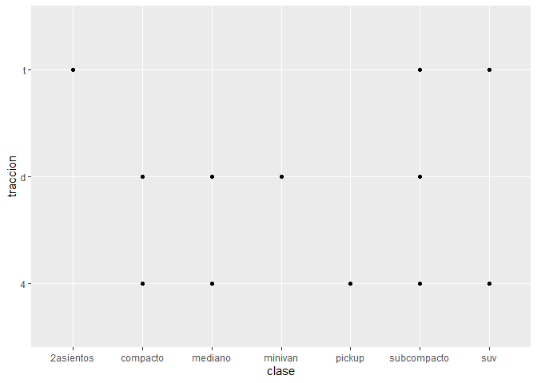
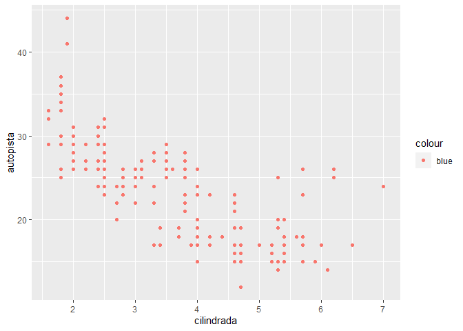

PROGRAMACION - TAREA 4
================
GRUPO 10 \|
24/01/2022

**Integrantes:** *ALARCON CANDIOTTE*, Arthur \| *CALDAS MORALES*,
Fernando \| *VARGAS CAMPOS*, Valia

``` r
library(tidyverse)
```

    ## -- Attaching packages --------------------------------------- tidyverse 1.3.1 --

    ## v ggplot2 3.3.5     v purrr   0.3.4
    ## v tibble  3.1.5     v dplyr   1.0.7
    ## v tidyr   1.1.4     v stringr 1.4.0
    ## v readr   2.1.1     v forcats 0.5.1

    ## -- Conflicts ------------------------------------------ tidyverse_conflicts() --
    ## x dplyr::filter() masks stats::filter()
    ## x dplyr::lag()    masks stats::lag()

``` r
library(datos)
```

# 10. Ejercicios: ggplot2

## 10.1. Parte 1: Ggplot base

**1. Corre `ggplot(data = millas)`.¿Que observas?**

``` r
ggplot(data = millas)
```

<!-- -->

Se va a observar un grafico vacío donde solo se ve el fondo, pero no se
ve nada sobre él porque no se han especificado otras capas, como aes()
para mapear las variables y geom\_\*() para indicar la representación
grafica a utilizar.

**2. ¿Cuantas filas hay en `millas`?¿Cuantas columnas?**

``` r
nrow(millas)
```

    ## [1] 234

``` r
ncol(millas)
```

    ## [1] 11

Hay 234 filas y 11 columnas en el dataset `millas`.

**3. ¿Que describe la variable `traccion`? Lee la ayuda de `millas` para
encontrar la respuesta.**

`traccion` esa una variable categorica que clasifica los vehiculos en
traccion delantera, trasera o de cuatro ruedas.

``` r
unique(millas$traccion)
```

    ## [1] "d" "4" "t"

**4. Realiza un grafico de dispersion de `autopista` versus
`cilindros`.**

``` r
ggplot(millas, aes(x = autopista, y = cilindros)) +
  geom_point()
```

<!-- -->

**5. ¿Que sucede cuando haces un grafico de dispersion de `clase` versus
`traccion`?¿Por que no es util este grafico?**

El grafico resultante tiene pocos puntos. Ambas variables son
categoricas y por lo tanto existe una cantidad limitada de combinaciones
posibles.

``` r
ggplot(millas, aes(x = clase, y = traccion)) +
  geom_point()
```

<!-- -->

## 10.2. Parte 2: Mapeos esteticos

**1. ¿Que no va bien en este codigo?¿Por que hay puntos que no son
azules?**

``` r
   ggplot(data = millas) +
     geom_point(mapping = aes(x = cilindrada, y = autopista, color = "blue"))
```

<!-- -->

Incluye el color dentro de `aes()`, por lo que lo lee como una variable,
lo cual seria util si se tuviera una columna con informacion de los
colores.

Para dejar todos los puntos en color azul, se debe cambiar el orden de
los parametros.

``` r
ggplot(data = millas) +
     geom_point(mapping = aes(x = cilindrada, y = autopista), color = "blue")
```

<!-- -->

**2. ¿Que variables en `millas` son categoricas? ¿Que variables son
continuas? (Pista: escribe `?millas` para leer la documentacion de ayuda
para este conjunto de datos). ¿Como puedes ver esta informacion cuando
ejecutas `millas`?**

Variables categoricas: modelo, transmision, traccion, combustible y
clase.

Variables continuas: cilindrada, año, cilindros, ciudad, autopista.

**3. Asigna una variable continua a `color`, `size`, y `shape`. ¿Como se
comportan estas estdisticas de manera diferente para variables
categoricas y variables continuas?**

``` r
ggplot(millas, aes(x = cilindrada, y = autopista, colour = ciudad)) +
  geom_point()
```

<!-- -->

**4. ¿Que ocurre si asignas o mapeas la misma variable a multiples
estaticas?**

R va a generar un grafico con informacion rebundante, lo cual se debiera
evitar.

``` r
ggplot(millas, aes(x = cilindrada, y = autopista, colour = autopista, size = autopista)) +
  geom_point()
```

<!-- -->

**5. ¿Que hace la estetica `stroke`? ¿Con que formas trabaja? (Pista:
consultar `?geom_point`)**

Con `stroke` Cambia el tamaño de los bordes de las formas 21 a 25, por
lo que tambien es posible cambiar el color de relleno y borde y tambien
el tamaño de los bordes.

**6. ¿Que ocurre si se asigna o mapea una estatica a algo diferente del
nombre de una variable, como ser `aes(color = cilindrada < 5)`?**

Se crea una variable temporal que actica la evaluacion de la variable.
En el caso de `cilindrada < 5` el resultado es verdadero o falso y segun
esto se incluyen los colores en el grafico.

``` r
ggplot(millas, aes(x = cilindrada, y = autopista, colour = cilindrada < 5)) +
  geom_point()
```

<!-- -->

## 10.3. Parte 3: Facetas

**1. ¿Que ocurre si intentas separar en facetas a una variable
continua?**

``` r
ggplot(millas, aes(x = cilindros, y = autopista)) +
  geom_point() +
  facet_grid(. ~ ciudad)
```

<!-- -->

La variable continua es convertida a una variable categorica y el
grafico contiene una faceta para cada valor

**2. ¿Que significan las celdas vacias que aparecen en el grafico
generado usando `facet_grid(traccion ~ cilindros)`? ¿Como se relacionan
con este grafico?**

``` r
ggplot(data = millas) +
     geom_point(mapping = aes(x = traccion, y = cilindros))
```

<!-- -->

``` r
ggplot(data = millas) +
  geom_point(mapping = aes(x = autopista, y = ciudad)) +
  facet_grid(traccion ~ cilindros)
```

<!-- -->

Las celdas vacias en este grafico corresponden a combinaciones de
`traccion` y `cilindros` que no tienen observaciones.

**3. ¿Que grafica el siguiente codigo?¿Que hace `.` ?**

``` r
   ggplot(data = millas) +
     geom_point(mapping = aes(x = cilindrada, y = autopista)) +
     facet_grid(traccion ~ .)
   
   ggplot(data = millas) +
     geom_point(mapping = aes(x = cilindrada, y = autopista)) +
     facet_grid(. ~ cilindros)
```

El simbolo `.` ignora la dimension al momento de dibujar las facetas.

``` r
ggplot(data = millas) +
  geom_point(mapping = aes(x = cilindrada, y = autopista)) +
  facet_grid(traccion ~ .)
```

<!-- -->

A la vez, `. ~ cilindrada` divide los valores de `cyl` en el eje x.

``` r
ggplot(data = millas) +
  geom_point(mapping = aes(x = cilindrada, y = autopista)) +
  facet_grid(. ~ cilindros)
```

<!-- -->

**4. Mira de nuevo el primer grafico en facetas presentado en esta
seccion:**

``` r
   ggplot(data = millas) +
     geom_point(mapping = aes(x = cilindrada, y = autopista)) +
     facet_wrap(~ clase, nrow = 2)
```

**¿Cuales son las ventajas de separar en facetas en lugar de aplicar una
estetica de color?¿Cuales son las desventajas?¿Como cambiaria este
balance si tuvieras un conjunto de datos mas grande?**

En el siguiente grafico se muestra la variable `clase` como color.

``` r
ggplot(data = millas) +
  geom_point(mapping = aes(x = cilindrada, y = autopista, color = clase))
```

<!-- -->

La ventaja de usar `clase` como parte de las facetas en lugar de un
argumento de color es la posibilidad de incluir distintas categorias. Es
dificil distinguir entre los colores de las categorias “mediano” y
“minivan”.

La desventaja de usar `clase` para las facetas en lugar del argumento de
color es la dificultad de comparar valores entre categorias dado que las
observaciones para cada categoria se ubican en distintos graficos.

Si aumenta mucho el numero de categorias va a ser cada vez mas dificil
contar con colores distintivos y sera dificil distinguirlos.

**5. Lee `?facet_wrap`. ¿Que hace `nrow`?¿Que hace `ncol`? ¿Que otras
opciones controlan el diseño de los paneles individuales? ¿Por que
`facet_grid()` no tiene argumentos `nrow` y `ncol`?**

Los argumentos `nrow` y `ncol` determinan el numero de filas y columnas
al momento de generar las facetas. `facet_wrap()` opera sobre una unica
variable.

`nrow` y `ncol` no son necesarios con `facet_grid` ya que el numero de
valores uuicos en la funcion determina el numero de filas y columnas.

**6. Cuando usas `facet_grid()`, generalmente deberas poner la variable
con un mayor numero de niveles unicos en las columnas. ¿Por que?**

Porque hacerlo genera un espacio para las columnas si el grafico se
ubica de forma horizontal.

## 10.6. Parte 6: Ajustes de posicion

**1. ¿Cual es el problema con este grafico?¿Como podrias mejorarlo?**

``` r
   ggplot(data = millas, mapping = aes(x = ciudad, y = autopista)) +
     geom_point()
```

<!-- -->

Se puede mejorar el grafico usando el argumento de distorsion y asi
reducir la superposicion.

``` r
ggplot(data = millas, mapping = aes(x = ciudad, y = autopista)) +
  geom_point(position = "jitter")
```

<!-- -->

**2. ¿Que parametros de `geom_jitter()` controlan la cantidad de
ruido?**

`width` controla el desplazamiento vertical `height` controla el
desplazamiento horizontal

Los valores por defecto de `width` y `height` introducen ruido en ambas
direcciones.

**3. Compara y contrasta `geom_jitter()` con `geom_count()`**

`geom_count()` va a cambiar el tamaño de los puntos relativos a la
cantidad de observaciones. Las combinaciones de `x` e `y` con mas
observaciones tendran un mayor tamaño. Ejemplo, `geom_count()` puede ser
menos legible que `geom_jitter()` si se agrega un argumento de color.

``` r
ggplot(data = millas, mapping = aes(x = ciudad, y = autopista, color = clase)) +
  geom_jitter()
```

<!-- -->

``` r
ggplot(data = millas, mapping = aes(x = ciudad, y = autopista, color = clase)) +
  geom_count()
```

<!-- -->

**4. ¿Cual es el ajuste de posicion predeterminado de `geom_boxplot()`?
Crea una visualizacion del conjunto de datos de `millas` que lo
demuestre.**

La posicion por defecto para `geom_boxplot()` es `"dodge2"`, que es un
atajo de `position_dodge2`. Este ajuste no cambia la posicion vertical
pero mueve las geometrias horizontalmente para evitar la superposicion.
Si agregamos `colour = clase` a un diagrama de cajas, los niveles de
`transmision` se ubican lado a lado.

``` r
ggplot(data = millas, aes(x = transmision, y = autopista, colour = clase)) +
  geom_boxplot()
```

<!-- -->

## 10.7. Parte 7: Sistemas de coordenadas

**1. Convierte un grafico de barras apiladas en un grafico circular
usando `coord_polar()`.**

``` r
ggplot(millas, aes(x = factor(1), fill = traccion)) +
  geom_bar()
```

<!-- -->

Con `coord_polar()`: “ojo de buey”.

``` r
ggplot(millas, aes(x = factor(1), fill = traccion)) +
  geom_bar(width = 1) +
  coord_polar()
```

<!-- -->

**2. ¿Que hace `labs()`? Lee la documentacion.`labs` agrega los titulos
de los ejes, titulo del grafico y la leyenda.**

``` r
ggplot(data = millas, mapping = aes(x = clase, y = autopista)) +
  geom_boxplot() +
  coord_flip() +
  labs(y = "Millas por Galon en Autopista",
       x = "Clase",
       title = "Millas por Galon en Autopista por Tipo de Vehiculo",
       subtitle = "1999-2008",
       caption = "Fuente: http://fueleconomy.gov")
```

<!-- -->

`labs()` no es la unica funcion para agregar titulos. `xlab()`, `ylab()`
y `ggtitle()` realizan la misma funcion.

**3. ¿Cual es la diferencia entre `coord_quickmap()` y `coord_map()`?**

`coord_map()` usa una proyeccion cartografica para proyectar la Tierra
sobre una superficie bidimensional. Por defecto usa la \[Proyeccion de
Mercator\]

`coord_quickmap()` usa una aproximacion mas rapida que ignora la
curvatura de la tierra y ajusta de acuerdo a la razon de latitud y
longitud.

**4. ¿Que te dice la grafica siguiente sobre la relacion entre la ciudad
y la `autopista`?¿Por que es `coord_fixed()` importante?¿Que hace
`geom_abline()`?**

``` r
   ggplot(data = millas, mapping = aes(x = ciudad, y = autopista)) +
     geom_point() +
     geom_abline() +
     coord_fixed()
```


La funcion `coord_fixed()` asegura que la linea que genera
`geom_abline()` tenga un angulo de 45 grados.

``` r
ggplot(data = millas, mapping = aes(x = ciudad, y = autopista)) +
  geom_point() +
  geom_abline() +
  coord_fixed()
```

<!-- -->
